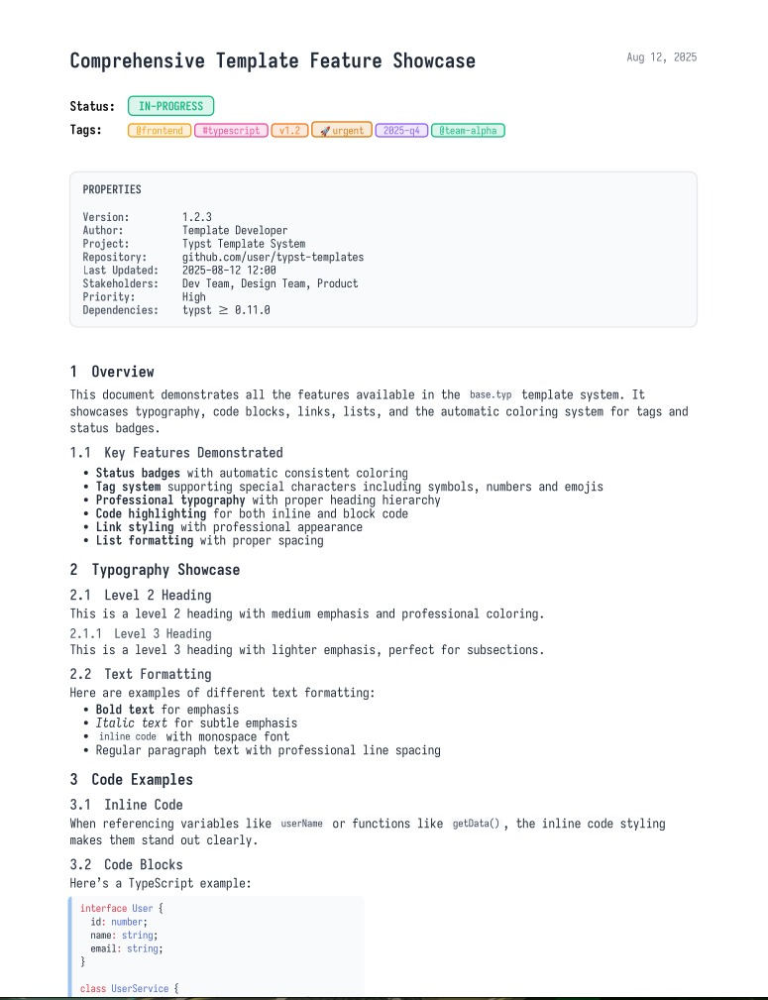

# typstwriter.nvim

> A complete Typst writing system for Neovim - from beautiful templates to intelligent personal knowledge management

[](https://opensource.org/licenses/MIT)
[](https://github.com/gl1tchc0d3r/typstwriter.nvim/actions)
[](https://github.com/gl1tchc0d3r/typstwriter.nvim/actions)
[](https://codecov.io/github/gl1tchc0d3r/typstwriter.nvim)
[](https://neovim.io)
[](https://typst.app)



*Professional document output with automated status badges, smart tag coloring, and beautiful typography - all generated from simple templates.*

## Philosophy: Why This Plugin Exists

As one of the few "progressive conservatives" in computing, I've spent decades with vi, vim, and now Neovim in the terminal - this is how I've used computers since the early Unix days. While others chase shiny GUI applications wrapped in Electron, I remain committed to never leaving the terminal.

### The Challenge

Modern tools like **Obsidian**, **VS Code**, **Excel**, **PowerBI**, **DBeaver**, **AnyType** - they encapsulate powerful functionality behind frustrating mouse-driven interfaces. They assume you want to leave your keyboard-centric workflow for their "user-friendly" GUIs. I refuse.

### The Markup Evolution

**LaTeX** has been the gold standard for typesetting since the late 80s/early 90s - a rich, powerful tool in any academic's toolbox. With its vast ecosystem of plugins and adaptations, LaTeX's typesetting capabilities remain unmatched. But it's often frustrating and difficult to get right, with syntax that can become unreadable.

**Markdown** evolved with the HTML/CSS mindset - thinking in terms of web presentation with confusing CSS iterations to make it presentable. It gained readability but was fundamentally designed for web rendering, not professional typesetting.

**Typst** changed everything. It offers:
- The simplicity of Vimwiki-like basic syntax
- Typesetting power comparable to LaTeX on a bad day (but evolving rapidly)
- Readable markup that doesn't sacrifice functionality
- A modern approach designed for documents, not web pages

When I discovered Typst, it struck a chord. What if I could replace my entire Markdown vault with YAML frontmatter notes using this superior tool? The typesetting may not match LaTeX's full power yet, but it's more than sufficient for my needs and improving constantly. And so this plugin was born.

### What to Expect

✅ **A complete terminal-native writing system** - No GUI dependencies, ever  
✅ **Professional document output** - High-quality PDFs from readable markup  
✅ **Keyboard-driven workflow** - Everything accessible via keybindings and commands  
✅ **Progressive enhancement** - Starting with templates, evolving toward AI-assisted knowledge management  
✅ **Privacy-first approach** - Local processing, your data stays with you  
✅ **Beautiful typography** - Professional fonts and consistent styling out of the box  
✅ **Hackability above all** - Built to work exactly how you want it. As a progressive conservative, my preferences might change overnight - so everything stays configurable to change back the day after 😉

### What NOT to Expect

❌ **A GUI application** - This will never become an Electron app or require a browser  
❌ **Mouse-driven interface** - If you need to click things, this isn't for you  
❌ **Cloud dependencies** - No data harvesting, no mandatory accounts, no "sync services"  
❌ **LaTeX-level complexity** - We embrace Typst's simplicity over LaTeX's ultimate power  
❌ **Beginner-friendly onboarding** - This assumes you're comfortable with Neovim and the terminal  
❌ **Immediate perfection** - This is an evolving experiment in terminal-based knowledge management  
❌ **Overwhelming configurability (yet)** - First iteration focuses on core functionality; hackability will expand  
❌ **Support obligations** - Read the LICENSE: this is true open source → **Get everything, Expect nothing!**  
❌ **Guaranteed responses** - No expectations for pull requests, issues, code critique, or feedback  
❌ **Roadmap commitments** - Features may or may not happen, when they happen, if they happen  

### The Vision

With this plugin, I'm testing how far Typst can go as my primary markup tool, paired with my favorite terminal and Neovim workflow. The goal isn't to compete with mainstream tools - it's to prove that keyboard-driven, terminal-native productivity can be more powerful and pleasant than any GUI.

This is shared in the spirit of true open source: take it, fork it, improve it, or ignore it. I built this for myself, and I'm sharing it because others might find it useful. But I owe you nothing beyond what's already here.

If you share this philosophy, welcome to the experiment. If you're looking for another Electron app with pretty buttons or guaranteed support, you're in the wrong place.

## Current Features

### Metadata-Driven Template System
- **Native Typst metadata** using `#metadata()` function for structured document properties
- **Dynamic template discovery** - automatically finds and validates all `.typ` templates
- **Metadata validation** - ensures required fields (type, title) are present
- **Clean filename generation** with optional random suffixes for uniqueness
- **Template introspection** using `typst query` for robust metadata extraction

### Streamlined Workflow  
- **One-command document creation** from metadata-validated templates
- **Integrated compilation** - compile to PDF and open instantly
- **Smart file naming** - generates clean filenames like `meeting.A7bX9K.typ`
- **Cross-platform** support (Linux, macOS, Windows)
- **Modern UI integration** with vim.ui.select/input when available

### Professional Output
- **Beautiful typography** with professional font stacks and consistent styling
- **Metadata-driven content** - templates use native Typst metadata for dynamic content
- **Template consistency** - shared styling and utilities across all templates
- **Clean document structure** with proper heading hierarchy and spacing

## Installation

### With [lazy.nvim](https://github.com/folke/lazy.nvim)

```lua
{
  "gl1tchc0d3r/typstwriter.nvim",
  branch = "feature-twriter-link", -- Use the v2 branch
  ft = "typst",
  cmd = {
    "TypstWriterNew",
    "TypstWriterCompile", 
    "TypstWriterOpen",
    "TypstWriterBoth",
    "TypstWriterStatus",
    "TypstWriterTemplates"
  },
  keys = {
    { "<leader>Tn", "<cmd>TypstWriterNew<cr>", desc = "New document" },
    { "<leader>Tc", "<cmd>TypstWriterCompile<cr>", desc = "Compile", ft = "typst" },
    { "<leader>To", "<cmd>TypstWriterOpen<cr>", desc = "Open PDF", ft = "typst" },
    { "<leader>Tb", "<cmd>TypstWriterBoth<cr>", desc = "Compile & open", ft = "typst" },
  },
  config = function()
    require('typstwriter').setup({
      notes_dir = "~/Documents/notes",
      template_dir = "~/Documents/notes/templates/v2",
    })
  end
}
```


## Configuration

### Default Configuration

```lua
require('typstwriter').setup({
  -- Directory settings
  notes_dir = "~/Documents/notes",
  template_dir = nil, -- defaults to notes_dir/templates/v2
  
  -- Template preferences
  default_template_type = "note",
  auto_date = true, -- Automatically set date to today in metadata
  
  -- Filename generation
  use_random_suffix = true, -- Add random suffix for uniqueness
  random_suffix_length = 6, -- Length of random suffix
  
  -- Compilation settings
  auto_compile = false,
  open_after_compile = true,
  
  -- Metadata validation
  require_metadata = true, -- Validate metadata in templates
  required_fields = { "type", "title" }, -- Required metadata fields
  
  -- Key mappings (set to false to disable)
  keymaps = {
    new_document = "<leader>Tn",
    compile = "<leader>Tc",
    open_pdf = "<leader>To", 
    compile_and_open = "<leader>Tb",
  },
  
  -- Notifications
  notifications = {
    enabled = true,
    level = vim.log.levels.INFO,
  },
})
```

### Custom Configuration Example

```lua
require('typstwriter').setup({
  notes_dir = "~/my-notes",
  template_dir = "~/my-notes/templates",
  auto_compile = true,
  use_random_suffix = false, -- Disable random suffixes
  auto_date = false, -- Don't auto-update dates
  keymaps = {
    new_document = "<leader>nn",
    compile = "<leader>cc",
    open_pdf = "<leader>oo",
    compile_and_open = false, -- Disable this keymap
  }
})
```

## Usage

### Commands

| Command | Description |
|---------|-------------|
| `:TypstWriterNew` | Create new document from template |
| `:TypstWriterCompile` | Compile current document to PDF |
| `:TypstWriterOpen` | Open PDF of current document |
| `:TypstWriterBoth` | Compile and open PDF |
| `:TypstWriterStatus` | Show system status and metadata info |
| `:TypstWriterTemplates` | List available templates |

### Watch Mode & Auto-Compilation

The plugin supports automatic recompilation when files are saved:

```lua
require('typstwriter').setup({
  auto_compile = true,        -- Enable auto-compilation on save
  open_after_compile = true,  -- Auto-open PDF after compilation
})
```

With this configuration:
- Every time you save a Typst file (`:w`), it automatically recompiles
- The PDF viewer refreshes to show your changes instantly
- Perfect for real-time document editing and preview

**Note**: If you're using `TypstWatch` from another plugin (like `typst.vim`), that's separate from this templating plugin but works great alongside it!

### Default Key Mappings

| Key | Mode | Action |
|-----|------|--------|
| `<leader>Tn` | Normal | Create new document |
| `<leader>Tc` | Normal (Typst files) | Compile to PDF |
| `<leader>To` | Normal (Typst files) | Open PDF |
| `<leader>Tb` | Normal (Typst files) | Compile and open |

### Basic Workflow

1. **Create a new document**: Press `<leader>Tn` or run `:TypstWriterNew`
2. **Select template**: Choose from metadata-validated templates
3. **Enter document title**: Provide a title for your document
4. **Edit**: The new file opens automatically with updated metadata
5. **Compile**: Press `<leader>Tc` or run `:TypstWriterCompile`
6. **View**: Press `<leader>To` or run `:TypstWriterOpen` to view the PDF

## Templates

### Metadata-Driven Template Structure

Templates are `.typ` files with native Typst metadata using the `#metadata()` function. The plugin:
- Discovers all `.typ` files automatically
- Validates metadata using `typst query` command
- Requires `type` and `title` fields for proper functionality
- Skips templates without valid metadata (with warnings)

### Example Template Directory

```
templates/v2/
├── meeting.typ    # Meeting notes template
├── note.typ       # General note template
├── project.typ    # Project documentation template
├── article.typ    # Article template
└── report.typ     # Report template
```

### Creating Custom Templates

1. Create a `.typ` file in your template directory
2. Include metadata at the top using the `#metadata()` function:

```typst
#metadata((
  type: "custom",
  title: "My Custom Template",
  description: "Template for custom documents",
  author: "Your Name",
  date: "2025-01-01",
  tags: ("custom", "template"),
)) <}

// Template content starts here
= Document Title

This is my custom template content.

== Section 1

Content here will be preserved when creating new documents.

== Section 2

The metadata above will be updated automatically when creating new documents.
```

### Metadata Fields

Required fields for all templates:
- `type`: Document type (e.g., "meeting", "note", "project")
- `title`: Template title (updated when creating new documents)

Optional fields:
- `description`: Template description for selection UI
- `author`: Document author
- `date`: Document date (auto-updated if `auto_date` is enabled)
- `tags`: Array of tags for categorization
- Any other fields your templates need

### Template Examples

**Meeting Template** (`meeting.typ`):
```typst
#metadata((
  type: "meeting",
  title: "Meeting Template",
  description: "Template for meeting notes",
  date: "2025-01-01",
  tags: ("meeting", "work"),
)) <}

= Meeting: #metadata((<}).title

*Date:* #metadata((<}).date  
*Type:* #metadata((<}).type

== Agenda

== Discussion

== Action Items

== Next Steps
```

## Requirements

- **Neovim** >= 0.7.0
- **Typst binary** - Install from [typst.app](https://typst.app) or your package manager
- **PDF viewer** - Any system PDF viewer (`xdg-open`, `open`, `start`)
- **Nerd Font** (recommended) - For enhanced visual appearance with icons
  - Primary font: Iosevka Nerd Font (NFP/NFM variants)
  - Fallback fonts: Hack Nerd Font, DejaVu Sans/Mono, or any Nerd Font
  - Install from: https://www.nerdfonts.com/font-downloads
  - Templates use professional font stacks for optimal rendering

## Troubleshooting

### Typst binary not found
```bash
# Install Typst
# On macOS:
brew install typst

# On Linux (cargo):
cargo install --git https://github.com/typst/typst --tag v0.10.0 typst-cli

# Or download from: https://github.com/typst/typst/releases
```

### Check plugin status
```vim
:TypstWriterStatus  # Shows compilation status and system requirements
```

### Template not found
- Ensure templates are in the correct directory (`template_dir`)
- Check that files have `.typ` extension and valid metadata
- Run `:TypstWriterTemplates` to list available templates
- Check metadata validation with `:TypstWriterStatus`

### Font/Icon Issues
```bash
# Check available fonts in Typst
typst fonts

# Look for Nerd Fonts (should see entries like:)
# - Iosevka NFP (proportional)
# - Iosevka NFM (monospace)
# - Hack Nerd Font
# - Symbols Nerd Font
```

If icons don't display correctly:
1. Install a Nerd Font from [nerdfonts.com](https://www.nerdfonts.com)
2. Verify the font is available with `typst fonts`
3. The templates use "Iosevka NFP/NFM" by default with fallbacks
4. You can modify the font stacks in `base.typ` to use different fonts

## Contributing

Contributions are welcome! Please feel free to submit a Pull Request.

## License

MIT License - see the [LICENSE](LICENSE) file for details.

## Future Vision: Personal Knowledge System

**typstwriter.nvim** is evolving beyond templating into a comprehensive **Personal Knowledge System (PKS)** that rivals Obsidian while remaining entirely terminal-based.

### Planned Features

#### **Phase 1: Intelligent Linking**
```vim
:TWriterLink          " Interactive document linking with fuzzy search
:TWriterFollow        " Follow links under cursor with navigation history
:TWriterBacklinks     " Discover and navigate backlinks
```

#### **Phase 2: Smart Search & Discovery**
```vim
:TWriterSearch @frontend status:todo    " Multi-criteria metadata search
:TWriterBrowse                          " Visual document browser with filtering
:TWriterTags                            " Tag management and renaming
```

#### **Phase 3: Visual Knowledge Graphs**
```vim
:TWriterGraph         " Generate beautiful relationship maps in Typst
:TWriterInsights      " AI-powered knowledge base analysis
```

#### **Phase 4: Local AI Integration** 🤖
```vim
:TWriterChat          " Chat with your notes using local LLM (Ollama)
:TWriterAINew         " AI-assisted document creation
:TWriterAIEnhance     " Smart content suggestions and improvements
:TWriterAISearch      " Semantic search through your knowledge base
```

**Privacy-First AI:** All AI features use local models (Ollama, llamafile) - your data never leaves your machine.

### The Vision

Imagine the **best aspects** of:
- **Obsidian's** linking and graph views
- **Notion's** AI writing assistance  
- **Roam's** bi-directional connections
- **LaTeX's** professional typesetting

...but **entirely in your terminal** with **local AI** and **no privacy compromises**.

**See the full roadmap**: [ROADMAP.md](./ROADMAP.md)

---

## Acknowledgments

- [Typst](https://typst.app) - The amazing typesetting system that makes this possible
- [Neovim](https://neovim.io) - The extensible text editor that powers the experience  
- [Ollama](https://ollama.ai) - Making local AI accessible for the future PKS features
- The Neovim community for excellent plugin development patterns
- The terminal-first computing philosophy that refuses to compromise
